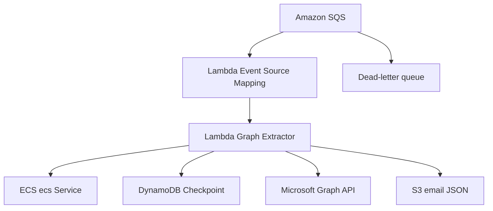

# PRD — Lambda de Extração Incremental de E-mails do Microsoft Graph

**Status:** Pronto para desenvolvimento  
**Versão:** 1.0  
**Data:** 11/09/2026  
**Linguagem:** Go  
**Execução:** AWS Lambda acionada por Amazon SQS  
**Persistência:** Amazon S3 e Amazon DynamoDB  
**Origem dos dados:** Microsoft Graph API v1.0  

---

## 1. principal

Desenvolva um projeto completo em Go para uma AWS Lambda que consome mensagens de uma fila Amazon SQS, obtém de um ECS interno delegado do Microsoft Graph para o usuário informado, consulta no DynamoDB a última extração concluída, busca todos os e-mails do período aplicável na Microsoft Graph API, percorre toda a paginação, salva cada e-mail como JSON no Amazon S3 e atualiza o checkpoint no DynamoDB somente após a persistência integral da janela.

O projeto deve ser executável, testável e preparado para implantação em AWS Lambda. Não gerar somente exemplos ou pseudocódigo. Implementar código de produção, testes unitários, configuração, observabilidade, tratamento de erros, documentação e infraestrutura como código conforme as definições deste PRD.

Não inventar URLs, nomes de recursos AWS, mecanismos de autenticação interna ou campos obrigatórios não definidos. Tudo que depender do ambiente deve ser configurável por variável de ambiente.

---

## 2. Contexto

O sistema precisa extrair e-mails de usuarios autorizados por meio de permissões delegadas do Microsoft Graph. O processo ocorre em background, sem o usuário conectado no momento da extração.

O fluxo de autenticação e renovação já existe em outro serviço executado no Amazon ECS. Essa Lambda não implementará MSAL, OBO, refresh ou cache . Ela será cliente do ECS  e receberá dele um access válido para o usuário da mensagem.

Nesta primeira entrega, a Lambda processará somente e-mails. A arquitetura deve permitir que futuramente seja criado um extrator de transcrições sem misturar suas regras específicas com as regras de e-mail.

---

## 3. Objetivo

Construir um processo resiliente e idempotente que:

1. Receba pelo SQS a identificação de um usuário.
2. Obtenha um access delegado válido por meio do ECS interno.
3. Determine a janela de extração a partir do checkpoint no DynamoDB.
4. Busque todos os e-mails dessa janela no Microsoft Graph.
5. Percorra todas as páginas retornadas pela API.
6. Salve cada e-mail em formato JSON no S3.
7. Atualize o checkpoint somente quando a extração for concluída com sucesso.
8. Permita retry seguro sem perda de e-mails e sem duplicações lógicas.

---

## 4. Fora do escopo

Não faz parte desta entrega:

- implementar autenticação do front-end;
- executar OBO diretamente na Lambda;
- acessar ou persistir refresh na Lambda;
- implementar o cache MSAL;
- criar ou renovar subscriptions do Microsoft Graph;
- utilizar delta query;
- extrair transcrições;
- executar regras de negócio, classificação ou geração de insights com IA;
- gravar e-mails em banco relacional;
- criar interface web;
- fazer download ou persistência de anexos;
- alterar, excluir ou marcar e-mails no Microsoft 365.

---

## 5. Premissas

- O App Registration e os consentimentos delegados já estão configurados.
- O entregue pelo ECS possui permissão suficiente para ler o conteúdo necessário dos e-mails, tipicamente `Mail.Read`.
- O representa o mesmo usuário indicado na mensagem SQS.
- O ECS de é acessível pela rede da Lambda, preferencialmente dentro da mesma VPC por endpoint interno.
- A fila SQS, sua DLQ, o bucket S3 e a tabela DynamoDB existem ou poderão ser criados pela infraestrutura como código.
- Todos os horários internos e persistidos usarão UTC e formato RFC 3339/ISO 8601.
- A data inicial da primeira carga será calculada como `extractionEndTime - INITIAL_LOOKBACK_DAYS`, com valor padrão de 365 dias.
- A execução não dependerá da ordem das mensagens na fila.

---

## 6. Arquitetura de alto nível



O Event Source Mapping é um recurso gerenciado do AWS Lambda que consulta a fila e invoca a função com lotes de mensagens. Ele deve ser configurado na infraestrutura, não implementado dentro do código Go.

---

## 7. Fluxo funcional detalhado

Para cada registro recebido do SQS:

1. Gerar ou reutilizar um `correlationId`.
2. Desserializar e validar a mensagem.
3. Capturar `extractionEndTime` em UTC antes de consultar o Graph.
4. Consultar o checkpoint do usuário e do tipo `EMAIL` no DynamoDB.
5. Definir `extractionStartTime`:
   - se não existir checkpoint concluído: `extractionEndTime - INITIAL_LOOKBACK_DAYS`;
   - se existir: `lastSuccessfulExtractionAt - OVERLAP_SECONDS`.
6. Chamar o ECS de tokens informando o `userId`.
7. Validar a resposta do ECS e obter o access token.
8. Chamar `GET /me/messages` no Microsoft Graph com filtro por período, `$select` e `$top`.
9. Persistir os e-mails de cada página no S3.
10. Enquanto existir `@odata.nextLink`, chamar exatamente a URL recebida, sem reconstruir `$skip` ou `$skiptoken`.
11. Ao terminar todas as páginas, atualizar o checkpoint com `extractionEndTime`.
12. Retornar sucesso individual para o registro do SQS.
13. Se houver falha em qualquer etapa, não avançar o checkpoint e retornar o item como falha parcial do lote.

---

## 8. Contrato da mensagem SQS

### 8.1 Payload de entrada

```json
{
  "schemaVersion": "1.0",
  "userId": "123456",
  "userPrincipalName": "usuario@empresa.com",
  "correlationId": "f87cf1ba-e61f-4a7a-a79d-5baab94b8f62",
  "requestedAt": "2026-09-11T10:00:00Z"
}
```

### 8.2 Campos

| Campo | Obrigatório | Regra |
| --- | --- | --- |
| `schemaVersion` | Sim | Nesta versão deve ser `1.0`. |
| `userId` | Sim | Identificador imutável do usuário usado pelo ECS e pelo checkpoint. |
| `userPrincipalName` | Não | Usado apenas como metadado e diagnóstico; não deve ser usado como chave principal. |
| `correlationId` | Não | Se ausente, gerar UUID. |
| `requestedAt` | Não | Data de criação da solicitação em UTC. |

### 8.3 Validação

- Rejeitar mensagem sem `userId` ou com `schemaVersion` incompatível.
- Nunca registrar, corpo completo do e-mail ou dados sensíveis da mensagem em logs.
- Mensagem inválida deve ser marcada como falha do lote para seguir a política de retry/DLQ. Se a organização preferir não repetir erros permanentes de contrato, disponibilizar configuração documentada para descartá-la ou enviá-la a uma fila de quarentena; o padrão desta entrega será retry/DLQ.

---

## 9. Integração SQS → Lambda

Configurar Event Source Mapping com:

- `ReportBatchItemFailures` habilitado;
- resposta parcial de lote por `messageId`;
- `batchSize` configurável, padrão inicial `5`;
- `maximumBatchingWindow` configurável, padrão `0`;
- DLQ configurada na fila de origem;
- `maxReceiveCount` inicial recomendado: `5`;
- visibility timeout maior que o timeout máximo efetivo da Lambda, seguindo o padrão corporativo e a recomendação vigente da AWS;
- limite de concorrência configurável para proteger o ECS e o Microsoft Graph.

O handler deve processar todos os registros do lote e devolver:

```json
{
  "batchItemFailures": [
    {
      "itemIdentifier": "message-id-com-falha"
    }
  ]
}
```

Uma falha de um usuário não pode obrigar o reprocessamento dos usuários que tiveram sucesso no mesmo lote.

---

## 10. Contrato do ECS

O código deve declarar uma porta/interface para obtenção. A implementação HTTP será um adapter substituível.

### 10.1 Requisição lógica

```http
POST {ECS_SERVICE_BASE_URL}{ECS_SERVICE_PATH}
Content-Type: application/json
X-Correlation-ID: {correlationId}
```

```json
{
  "userId": "123456"
}
```

### 10.2 Resposta lógica esperada

```json
{
  "ECS": "eyJ...",
  "ECSType": "Bearer",
  "expiresAt": "2026-09-11T11:00:00Z"
}
```

### 10.3 Regras

- A rota exata e o formato final devem ser configuráveis/adaptáveis ao contrato real do ECS.
- Não persistir.
- Não incluir em logs, métricas ou erros.
- Configurar timeout HTTP curto e explícito.
- Repetir apenas falhas transitórias: timeout, falha de conexão, HTTP `408`, `429` e `5xx`.
- Não repetir automaticamente erros funcionais `400`, `401`, `403` ou `404`, salvo contrato explícito diferente.
- Em `401` recebido do Graph, permitir no máximo uma nova obtenção e uma repetição da requisição que falhou. Evitar loop infinito.
- Caso o ECS indique `REQUIRES_LOGIN`, registrar métrica específica e falhar o item sem expor detalhes sensíveis. O fluxo de reativação do usuário permanece fora do escopo.
- O mecanismo de autenticação serviço-a-serviço deve ser plugável. Não assumir segredo fixo no código.

---

## 11. DynamoDB — modelo de checkpoint

### 11.1 Chaves

| Atributo | Tipo | Uso |
| --- | --- | --- |
| `userId` | String | Partition key. |
| `resourceType` | String | Sort key; nesta entrega, sempre `EMAIL`. |

### 11.2 Item sugerido

```json
{
  "userId": "123456",
  "resourceType": "EMAIL",
  "lastSuccessfulExtractionAt": "2026-09-11T10:30:00Z",
  "lastStartedAt": "2026-09-11T10:25:00Z",
  "lastCompletedAt": "2026-09-11T10:32:15Z",
  "lastCorrelationId": "f87cf1ba-e61f-4a7a-a79d-5baab94b8f62",
  "lastEmailCount": 843,
  "lastPageCount": 9,
  "status": "SUCCESS",
  "updatedAt": "2026-09-11T10:32:15Z"
}
```

### 11.3 Semântica do checkpoint

- `lastSuccessfulExtractionAt` representa o limite superior da última janela totalmente concluída.
- No início de uma execução, `extractionEndTime` deve ser capturado uma única vez.
- O filtro deve usar uma janela semiaberta:
  - `receivedDateTime ge extractionStartTime`
  - `receivedDateTime lt extractionEndTime`
- Nas execuções incrementais, subtrair `OVERLAP_SECONDS` do checkpoint, com padrão inicial de 300 segundos.
- O overlap poderá reler e-mails, por isso a gravação no S3 deve ser idempotente.
- Atualizar `lastSuccessfulExtractionAt` somente depois de todas as páginas terem sido persistidas.
- Uma execução com zero e-mails também é uma execução bem-sucedida e deve avançar o checkpoint.
- Não avançar checkpoint em processamento parcial.

### 11.4 Concorrência por usuário

Evitar duas extrações concorrentes do mesmo `userId/resourceType`.

Implementar lock lógico no DynamoDB, com atributos como:

```json
{
  "lockOwner": "correlation-id",
  "lockExpiresAt": 1789123200,
  "status": "PROCESSING"
}
```

Requisitos:

- adquirir lock com `ConditionExpression`;
- permitir substituição de lock expirado;
- liberar ou finalizar o lock com condição de proprietário;
- se já houver lock válido, tratar o item como falha transitória;
- não confiar no TTL do DynamoDB para liberação imediata; comparar `lockExpiresAt` na condição;
- proteger a conclusão com condição que confirme o mesmo `lockOwner`.

---

## 12. Consulta ao Microsoft Graph

### 12.1 Endpoint

```http
GET https://graph.microsoft.com/v1.0/me/messages
Authorization: Bearer {eco}
Prefer: outlook.body-content-type="text"
```

Utilizar `/me/messages` porque o ecs é delegado e representa o usuário que está sendo processado.

### 12.2 Query inicial

Construir os parâmetros usando encoding apropriado, sem concatenação insegura:

```text
$filter=receivedDateTime ge {start} and receivedDateTime lt {end}
$orderby=receivedDateTime asc
$top={GRAPH_PAGE_SIZE}
$select=id,conversationId,internetMessageId,subject,bodyPreview,body,from,sender,toRecipients,ccRecipients,bccRecipients,replyTo,receivedDateTime,sentDateTime,hasAttachments,importance,isRead,webLink,lastModifiedDateTime
```

Como `receivedDateTime` aparece no `$orderby`, ela deve também aparecer primeiro no `$filter`, evitando `InefficientFilter`.

`GRAPH_PAGE_SIZE` deve ser configurável. Valor inicial recomendado: `100`. Embora a API aceite valores maiores em alguns cenários, payloads grandes contendo corpo podem provocar timeout; medir antes de aumentar.

### 12.3 Paginação

- Ler `@odata.nextLink` da resposta.
- Usar a URL completa devolvida pelo Graph na próxima chamada.
- Não extrair, alterar nem reconstruir `$skip` ou `$skipecs`.
- Continuar até que `@odata.nextLink` esteja ausente ou vazio.
- Manter o cabeçalho `Authorization` e os demais cabeçalhos necessários em todas as páginas.
- Impor `GRAPH_MAX_PAGES` como proteção operacional configurável. Se o limite for atingido enquanto ainda existir `nextLink`, falhar sem avançar o checkpoint.

### 12.4 Throttling e retry

- Em HTTP `429`, respeitar o cabeçalho `Retry-After`.
- Em `408`, `429` e `5xx`, aplicar retry limitado.
- Quando não houver `Retry-After`, usar exponential backoff com jitter.
- Número de tentativas configurável, padrão `3` por requisição HTTP.
- O tempo total das tentativas deve respeitar o tempo restante da Lambda.
- Não repetir `400`, `403` ou `404` como falha transitória.
- Em `401`, aplicar somente a regra de renovação única descrita na seção do ECS.
- Nunca iniciar uma nova página se não houver tempo mínimo restante para concluí-la e persisti-la.

### 12.5 Modelo mínimo de resposta

```json
{
  "@odata.nextLink": "https://graph.microsoft.com/v1.0/me/messages?...",
  "value": [
    {
      "id": "AAMkAG...",
      "conversationId": "AAQkAG...",
      "subject": "Assunto",
      "receivedDateTime": "2026-09-11T09:30:00Z"
    }
  ]
}
```

O parser deve tolerar campos opcionais ausentes ou nulos.

---

## 13. Persistência no Amazon S3

### 13.1 Estratégia

Salvar um objeto JSON por e-mail. O objeto deve conter o payload selecionado do Graph e metadados técnicos da extração.

### 13.2 Chave do objeto

```text
email/user_id={userId}/received_date={YYYY-MM-DD}/message_id={safeMessageId}.json
```

O bucket é configurado por `S3_BUCKET_NAME`. O prefixo padrão é `email/` e pode ser alterado por `S3_EMAIL_PREFIX`.

O `messageId` do Graph pode conter caracteres impróprios para padronização da chave. Implementar uma transformação determinística e sem colisão prática, preferencialmente SHA-256 do ID original. Manter o ID original dentro do JSON.

Exemplo:

```text
s3://integratioungraphapi/email/user_id=123456/received_date=2026-09-11/message_id=9f5c....json
```

### 13.3 Envelope JSON

```json
{
  "schemaVersion": "1.0",
  "resourceType": "EMAIL",
  "userId": "123456",
  "extractedAt": "2026-09-11T10:32:10Z",
  "extractionWindow": {
    "start": "2026-09-11T08:00:00Z",
    "end": "2026-09-11T10:30:00Z"
  },
  "source": "MICROSOFT_GRAPH",
  "message": {
    "id": "AAMkAG...",
    "conversationId": "AAQkAG...",
    "subject": "Assunto",
    "receivedDateTime": "2026-09-11T09:30:00Z"
  }
}
```

### 13.4 Regras

- `Content-Type`: `application/json`.
- Codificação UTF-8.
- Serialização determinística quando viável.
- Criptografia em repouso obrigatória, usando configuração do bucket/SSE-KMS conforme o padrão corporativo.
- Bloqueio de acesso público no bucket.
- IAM com acesso apenas ao bucket/prefixo necessário.
- A regravação do mesmo e-mail deve utilizar a mesma chave e produzir comportamento idempotente.
- Não usar ACL pública.
- Se um `PutObject` falhar, falhar a execução daquele usuário e não avançar checkpoint.
- A quantidade de gravações paralelas deve ser limitada por `S3_WRITE_CONCURRENCY` para não saturar conexões/memória.

---

## 14. Idempotência e consistência

SQS oferece entrega pelo menos uma vez. A mesma mensagem pode ser processada novamente.

Garantias exigidas:

- chave S3 determinística por usuário e ID de e-mail;
- overlap temporal configurável para reduzir risco de lacuna;
- checkpoint atualizado somente no final;
- lock por usuário/recurso;
- conclusão condicional do checkpoint;
- reprocessamento deve sobrescrever o mesmo objeto, e não criar cópia com timestamp na chave;
- falhas parciais podem deixar alguns objetos no S3, mas nova tentativa deve completar o processo de forma segura;
- não é necessário rollback dos objetos já gravados;
- a consistência desta entrega é `at-least-once` na leitura e idempotente na materialização por ID.

Observação: e-mails podem ser modificados ou excluídos após a extração. Como esta versão filtra por `receivedDateTime`, ela não garante captura de alterações e exclusões posteriores. Essa limitação deve constar no README; delta query poderá ser avaliada em evolução futura.

---

## 15. Tratamento de erros

Criar erros tipados/categorizados internamente:

| Categoria | Exemplos | Retry do item |
| --- | --- | --- |
| `INVALID_MESSAGE` | JSON inválido, ausência de `userId` | Sim até DLQ, salvo futura quarentena |
| `LOCKED` | Extração do mesmo usuário em andamento | Sim |
| `ecs_REQUIRES_LOGIN` | Cache/ecs do usuário inválido | Sim até DLQ e métrica específica |
| `ecs_SERVICE_TRANSIENT` | Timeout, 429, 5xx | Sim |
| `ecs_SERVICE_PERMANENT` | 400, 403, 404 | Sim pelo SQS até DLQ, sem retry HTTP interno |
| `GRAPH_THROTTLED` | 429 | Sim, respeitando `Retry-After` |
| `GRAPH_UNAUTHORIZED` | 401 após uma renovação | Sim |
| `GRAPH_FORBIDDEN` | 403/permissão ausente | Sim até DLQ e alarme |
| `GRAPH_TRANSIENT` | Timeout, 408, 5xx | Sim |
| `GRAPH_PERMANENT` | Demais 4xx não transitórios | Sim até DLQ |
| `S3_WRITE_FAILED` | Falha de persistência | Sim |
| `CHECKPOINT_FAILED` | Falha no DynamoDB | Sim |
| `DEADLINE_RISK` | Tempo restante insuficiente | Sim |

Os erros devolvidos e registrados devem ser sanitizados. Nunca incluir ecs, conteúdo do e-mail ou payload integral do Graph.

---

## 16. Timeout e continuidade

Uma caixa postal com um ano de dados pode ultrapassar o limite máximo de uma única Lambda. Portanto:

- configurar timeout da Lambda de acordo com o padrão corporativo, sem assumir que 15 minutos sempre serão suficientes;
- verificar o tempo restante antes de cada próxima página;
- disponibilizar `MIN_REMAINING_TIME_SECONDS`, padrão `30`;
- se o tempo restante ficar abaixo do mínimo, falhar sem atualizar o checkpoint; a próxima tentativa recomeçará a janela e sobrescreverá objetos já gravados;
- não persistir `@odata.nextLink` como checkpoint nesta primeira versão, pois ele pode ser temporário e aumentaria a complexidade de consistência;
- medir volume, duração e memória na POC/carga antes de produção;
- se a carga inicial real não couber consistentemente em uma Lambda, evoluir o desenho para janelas menores, Step Functions ou mensagens de continuação. Não alterar automaticamente a semântica sem decisão arquitetural.

---

## 17. Observabilidade

### 17.1 Logs estruturados

Usar JSON e incluir quando aplicável:

- `level`;
- `timestamp`;
- `service`;
- `environment`;
- `awsRequestId`;
- `sqsMessageId`;
- `correlationId`;
- `userIdHash` ou identificador conforme política corporativa;
- `resourceType`;
- `operation`;
- `durationMs`;
- `pageNumber`;
- `emailCount`;
- `errorCategory`;
- `httpStatus`, sem payload sensível.

Não registrar:

- ecs;
- refresh;
- cabeçalho `Authorization`;
- corpo, assunto ou destinatários do e-mail;
- resposta completa do ECS ou Graph.

### 17.2 Métricas

Publicar via Embedded Metric Format ou solução corporativa equivalente:

- `SqsRecordsReceived`;
- `UsersProcessedSuccess`;
- `UsersProcessedFailure`;
- `EmailsExtracted`;
- `GraphPagesProcessed`;
- `GraphRequestLatencyMs`;
- `ecsServiceLatencyMs`;
- `S3WriteLatencyMs`;
- `ExtractionDurationMs`;
- `GraphThrottlingCount`;
- `RetryCount`;
- `RequiresLoginCount`;
- `LockConflictCount`;
- `CheckpointUpdateFailureCount`.

### 17.3 Alarmes sugeridos

- mensagens visíveis/idade da mensagem na fila acima do limite;
- mensagens na DLQ;
- taxa de erro da Lambda;
- throttling da Lambda;
- `GraphThrottlingCount` elevado;
- `RequiresLoginCount` elevado;
- ausência de sucesso dentro da janela operacional esperada.

---

## 18. Segurança

- Princípio do menor privilégio no IAM.
- Permitir somente `sqs:ReceiveMessage`, `sqs:DeleteMessage`, `sqs:GetQueueAttributes` na fila necessária.
- Permitir somente operações DynamoDB necessárias na tabela de checkpoint.
- Permitir somente `s3:PutObject` no bucket/prefixo de e-mails e ações KMS necessárias.
- Não armazenar segredos no repositório ou em variáveis de ambiente em texto puro.
- Usar Secrets Manager/SSM ou mecanismo corporativo para credenciais do ECS, se aplicável.
- Validar TLS; não permitir opção de desabilitar validação de certificado.
- Restringir egress da Lambda aos destinos necessários.
- Aplicar timeout, limites de payload e validação de URL.
- Para `@odata.nextLink`, aceitar somente HTTPS e host permitido `graph.microsoft.com` antes de executar a chamada.
- Não permitir que dados vindos da mensagem SQS controlem livremente URLs externas.
- Proteger S3, DynamoDB, SQS e DLQ com criptografia conforme o padrão corporativo.
- Aplicar varredura de dependências e manter versões fixadas no `go.mod`/`go.sum`.

---

## 19. Variáveis de ambiente

| Variável | Obrigatória | Padrão | Descrição |
| --- | --- | --- | --- |
| `ENVIRONMENT` | Sim | — | Ambiente da aplicação. |
| `SERVICE_NAME` | Não | `graph-email-extractor` | Nome do serviço. |
| `AWS_REGION` | Sim em execução real | Runtime | Região AWS. |
| `CHECKPOINT_TABLE_NAME` | Sim | — | Tabela DynamoDB. |
| `S3_BUCKET_NAME` | Sim | — | Bucket de destino. |
| `S3_EMAIL_PREFIX` | Não | `email/` | Prefixo dos objetos. |
| `S3_KMS_KEY_ID` | Conforme ambiente | — | Chave KMS, se exigida no `PutObject`. |
| `ecs_SERVICE_BASE_URL` | Sim | — | URL interna do ECS. |
| `ecs_SERVICE_PATH` | Não | `/ecs/background` | Caminho configurável. |
| `ecs_SERVICE_TIMEOUT_MS` | Não | `5000` | Timeout do ECS. |
| `GRAPH_BASE_URL` | Não | `https://graph.microsoft.com/v1.0` | Base do Graph. |
| `GRAPH_PAGE_SIZE` | Não | `100` | Tamanho de página inicial. |
| `GRAPH_HTTP_TIMEOUT_MS` | Não | `30000` | Timeout por requisição. |
| `GRAPH_MAX_RETRIES` | Não | `3` | Tentativas HTTP transitórias. |
| `GRAPH_MAX_PAGES` | Não | `10000` | Proteção operacional. |
| `INITIAL_LOOKBACK_DAYS` | Não | `365` | Período da primeira carga. |
| `OVERLAP_SECONDS` | Não | `300` | Sobreposição incremental. |
| `MIN_REMAINING_TIME_SECONDS` | Não | `30` | Margem antes do timeout. |
| `S3_WRITE_CONCURRENCY` | Não | `5` | Gravações simultâneas limitadas. |
| `LOCK_DURATION_SECONDS` | Não | Compatível com timeout | Validade do lock lógico. |
| `LOG_LEVEL` | Não | `INFO` | Nível de log. |

Validar todas as configurações no cold start e falhar com mensagem clara e sanitizada quando forem inválidas.

---

## 20. Arquitetura do código

Aplicar arquitetura hexagonal leve, sem criar abstrações artificiais. O domínio/use case não deve depender diretamente do SDK da AWS nem do cliente HTTP.

```text
graph-email-extractor/
├── cmd/
│   └── lambda/
│       └── main.go
├── internal/
│   ├── application/
│   │   └── usecase/
│   │       └── extract_emails.go
│   ├── domain/
│   │   ├── email.go
│   │   ├── checkpoint.go
│   │   ├── extraction_window.go
│   │   └── errors.go
│   ├── ports/
│   │   ├── ecs_provider.go
│   │   ├── email_source.go
│   │   ├── email_repository.go
│   │   ├── checkpoint_repository.go
│   │   ├── locker.go
│   │   ├── clock.go
│   │   └── metrics.go
│   ├── adapters/
│   │   ├── inbound/
│   │   │   └── sqs/
│   │   │       ├── handler.go
│   │   │       └── message.go
│   │   └── outbound/
│   │       ├── ecsservice/
│   │       │   ├── client.go
│   │       │   └── models.go
│   │       ├── graph/
│   │       │   ├── client.go
│   │       │   ├── models.go
│   │       │   └── retry.go
│   │       ├── s3/
│   │       │   └── email_repository.go
│   │       └── dynamodb/
│   │           └── checkpoint_repository.go
│   ├── config/
│   │   └── config.go
│   ├── observability/
│   │   ├── logger.go
│   │   └── metrics.go
│   └── platform/
│       ├── clock.go
│       └── httpclient.go
├── infrastructure/
│   └── terraform/
│       ├── main.tf
│       ├── variables.tf
│       ├── outputs.tf
│       └── versions.tf
├── testdata/
│   ├── sqs_event.json
│   └── graph_messages_page.json
├── Makefile
├── Dockerfile
├── go.mod
├── go.sum
├── README.md
└── .gitignore
```

Se o repositório existente tiver convenções diferentes, manter as convenções do repositório e preservar as mesmas responsabilidades arquiteturais.

---

## 21. Interfaces esperadas

Os nomes podem ser ajustados idiomaticamente, mas as responsabilidades devem permanecer claras.

```go
type ecsProvider interface {
    GetAccessecs(ctx context.Context, userID, correlationID string) (eco, error)
}

type EmailSource interface {
    ListEmails(ctx context.Context, eco string, window ExtractionWindow) (EmailIterator, error)
}

type EmailRepository interface {
    Save(ctx context.Context, userID string, window ExtractionWindow, email Email) error
}

type CheckpointRepository interface {
    Get(ctx context.Context, userID, resourceType string) (*Checkpoint, error)
    AcquireLock(ctx context.Context, userID, resourceType, owner string, expiresAt time.Time) error
    Complete(ctx context.Context, checkpoint Checkpoint, lockOwner string) error
    Release(ctx context.Context, userID, resourceType, lockOwner string) error
}
```

Não expor SDKs AWS ou modelos HTTP dentro das entidades de domínio.

---

## 22. Dependências e decisões técnicas

- Usar a versão de Go suportada pelo runtime AWS Lambda e aprovada pela empresa.
- Preferir `aws-lambda-go` para o handler.
- Usar AWS SDK for Go v2.
- Para Microsoft Graph, é aceitável usar `net/http` com modelos enxutos, reduzindo dependências e oferecendo controle claro de `@odata.nextLink`, retry e headers. Se optar pelo SDK oficial do Graph para Go, justificar no README e manter a porta desacoplada.
- Usar `context.Context` em todas as operações de I/O.
- Compartilhar clientes AWS e `http.Client` inicializados no cold start.
- Não criar novo `http.Client` por requisição.
- Usar timeouts explícitos.
- Evitar `panic` para erros operacionais.
- Manter código formatado com `gofmt` e validado com `go vet`.

---

## 23. Testes obrigatórios

### 23.1 Unitários

Implementar testes table-driven para:

1. Mensagem SQS válida.
2. JSON inválido.
3. `userId` ausente.
4. Primeira extração calculando 365 dias.
5. Extração incremental lendo checkpoint.
6. Aplicação de overlap.
7. Janela semiaberta correta.
8. Caixa sem e-mails avançando checkpoint.
9. Uma página sem `nextLink`.
10. Múltiplas páginas.
11. Uso exato de `nextLink`.
12. Campos opcionais/nulos do Graph.
13. `429` com `Retry-After`.
14. `5xx` com backoff limitado.
15. `401` obtendo novo ecs apenas uma vez.
16. `403` sem retry HTTP interno.
17. Falha no ECS sem chamada ao Graph.
18. Falha no S3 sem atualização do checkpoint.
19. Falha na segunda página sem atualização do checkpoint.
20. Falha ao atualizar checkpoint retornando erro.
21. Geração determinística da chave S3.
22. Reprocessamento sobrescrevendo a mesma chave.
23. Lock já ativo.
24. Lock expirado.
25. Conclusão rejeitada para `lockOwner` diferente.
26. Tempo restante insuficiente.
27. Resposta parcial do lote SQS contendo somente IDs com falha.
28. Dois usuários no mesmo lote: um sucesso e uma falha.
29. Sanitização de ecs e dados sensíveis nos erros/logs.
30. Bloqueio de `nextLink` com host não permitido.

Usar fakes/mocks pelas portas, sem acessar serviços reais nos testes unitários.

### 23.2 Integração local

- Servidor HTTP falso com endpoints do ECS e Graph.
- Respostas paginadas realistas.
- DynamoDB Local ou LocalStack, se permitido.
- S3 local/LocalStack, se permitido.
- Evento SQS em `testdata/sqs_event.json`.

### 23.3 Qualidade mínima

- `go test ./...` deve passar.
- `go test -race ./...` deve passar onde suportado.
- `go vet ./...` deve passar.
- Cobertura recomendada mínima: 80% nos pacotes de use case e domínio.
- Sem vulnerabilidades críticas conhecidas nas dependências.

---

## 24. Infraestrutura como código

Criar Terraform modular ou adaptar-se ao padrão do repositório para definir:

- função Lambda;
- role e políticas IAM mínimas;
- fila SQS;
- DLQ;
- redrive policy;
- Event Source Mapping;
- DynamoDB com partition key e sort key;
- bucket/prefixo/políticas apenas se o bucket não for compartilhado/existente;
- grupos de log e retenção;
- alarmes essenciais;
- variáveis e outputs;
- configuração VPC/subnets/security groups por parâmetros, se necessária para acessar o ECS;
- reserved concurrency ou maximum concurrency configurável.

Não aplicar Terraform automaticamente. Apenas produzir os arquivos e documentar comandos de `fmt`, `validate` e `plan`.

---

## 25. Build e implantação

Fornecer:

- `Makefile` com comandos `fmt`, `vet`, `test`, `test-race`, `build` e `package`;
- build para Linux e arquitetura configurável (`arm64` ou `amd64`);
- pacote ZIP compatível com runtime customizado/provided se necessário, ou imagem de container se esse for o padrão definido;
- `Dockerfile` multi-stage somente se o padrão de entrega for container;
- README com execução local, testes, configuração e implantação;
- exemplo de variáveis sem segredos;
- comandos não destrutivos de validação.

Não assumir CI/CD específico. Incluir uma seção com etapas genéricas que possa ser adaptada ao pipeline corporativo.

---

## 26. Critérios de aceite

O desenvolvimento será aceito quando:

- [ ] A Lambda receber e validar um evento SQS realista.
- [ ] A Lambda usar resposta parcial de lote.
- [ ] O ecs for obtido do ECS pelo `userId`.
- [ ] O ecs não aparecer em logs nem persistência.
- [ ] A primeira carga consultar os 365 dias anteriores ao `extractionEndTime`.
- [ ] Cargas posteriores usarem o checkpoint com overlap.
- [ ] O Graph for consultado usando filtro por `receivedDateTime`.
- [ ] Toda a paginação por `@odata.nextLink` for percorrida.
- [ ] `429` respeitar `Retry-After`.
- [ ] Cada e-mail for salvo como JSON em chave S3 determinística.
- [ ] Reprocessar a mesma mensagem não criar duplicata lógica.
- [ ] O checkpoint avançar em execução bem-sucedida, inclusive com zero e-mails.
- [ ] O checkpoint não avançar após falha parcial.
- [ ] Duas execuções do mesmo usuário forem protegidas por lock condicional.
- [ ] Uma falha em um item não reprocesse itens bem-sucedidos do lote.
- [ ] Os testes obrigatórios passarem.
- [ ] A infraestrutura como código puder ser validada.
- [ ] O README documentar decisões, limitações e operação.
- [ ] A estrutura permitir adicionar um extrator de transcrições sem alterar o domínio de e-mails.

---

## 27. Definição de pronto

- Código revisado e formatado.
- Testes unitários e de integração local executados.
- Build da Lambda gerado com sucesso.
- Terraform formatado e validado.
- Evidência de teste com múltiplas páginas.
- Evidência de retry em `429`.
- Evidência de falha no S3 sem avanço do checkpoint.
- Evidência de idempotência no reprocessamento.
- Logs sem dados sensíveis.
- Documentação atualizada.

---

## 28. Decisões que precisam ser confirmadas antes da produção

O  deve deixar estes itens configuráveis e registrar `TODO: ENVIRONMENT_DECISION` onde não houver resposta no repositório:

1. URL e contrato real do ECS.
2. Autenticação serviço-a-serviço com o ECS.
3. Nome real da fila, DLQ, tabela e bucket.
4. Se o bucket já existe e qual chave KMS utilizar.
5. Campos exatos do e-mail que o negócio necessita.
6. Se o corpo deve ser texto, HTML ou ambos.
7. Política corporativa para PII em logs e métricas.
8. Batch size e concorrência após teste de carga.
9. Runtime/versão exata do Go.
10. ZIP versus imagem de container.
11. Terraform versus ferramenta de IaC já adotada no repositório.
12. Tratamento operacional de `REQUIRES_LOGIN`.
13. Destino de mensagens permanentemente inválidas.
14. Volume máximo esperado por usuário e estratégia caso a carga inicial exceda o tempo da Lambda.

Essas pendências não impedem a criação da arquitetura, interfaces, fakes, testes e implementações configuráveis.

---

## 29. Evolução futura — transcrições

Preparar a composição do projeto para permitir um novo caso de uso, sem implementá-lo agora:

```text
application/usecase/extract_emails.go
application/usecase/extract_transcripts.go   # futuro
domain/email.go
domain/transcript.go                         # futuro
```

O extrator futuro poderá compartilhar:

- handler SQS ou roteamento por `resourceType`;
- `ecsProvider`;
- checkpoint e lock;
- cliente HTTP base;
- retry;
- observabilidade;
- persistência S3 genérica.

Ele deverá ter endpoint, escopos, paginação, chave S3 e modelo próprios. Não criar abstração genérica excessiva antes de existir o segundo caso concreto.

---

## 30. Referências técnicas oficiais

- Microsoft Graph — List messages: https://learn.microsoft.com/en-us/graph/api/user-list-messages?view=graph-rest-1.0
- Microsoft Graph — Paging: https://learn.microsoft.com/en-us/graph/paging
- Microsoft Graph — Throttling guidance: https://learn.microsoft.com/en-us/graph/throttling
- AWS Lambda — Using Lambda with Amazon SQS: https://docs.aws.amazon.com/lambda/latest/dg/with-sqs.html
- AWS Lambda — Handling errors for an SQS event source: https://docs.aws.amazon.com/lambda/latest/dg/services-sqs-errorhandling.html

---

## 31. Resultado esperado

Ao finalizar, o deve apresentar:

1. Resumo da solução implementada.
2. Árvore final de arquivos.
3. Decisões técnicas adotadas.
4. Itens de ambiente ainda pendentes.
5. Comandos para formatar, testar, compilar e empacotar.
6. Resultado dos testes e validações executados.
7. Riscos ou limitações encontrados.
8. Nenhuma alegação de sucesso sem executar os comandos de validação disponíveis.

